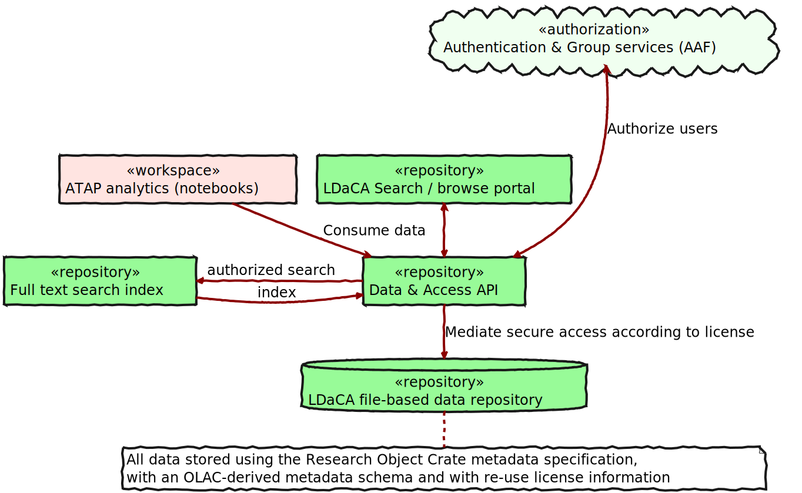
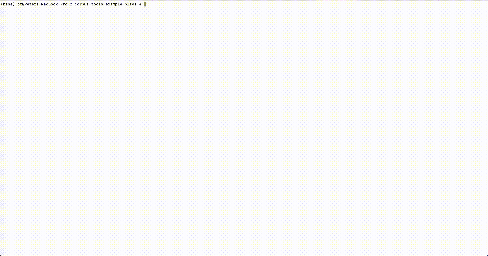
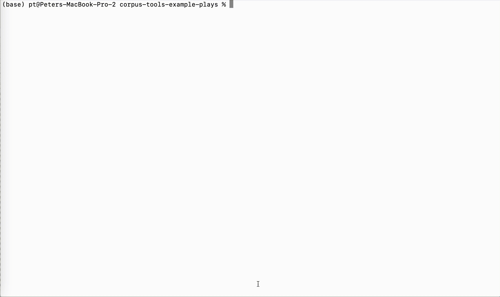
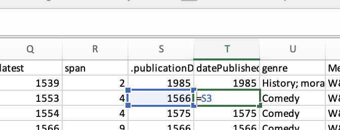
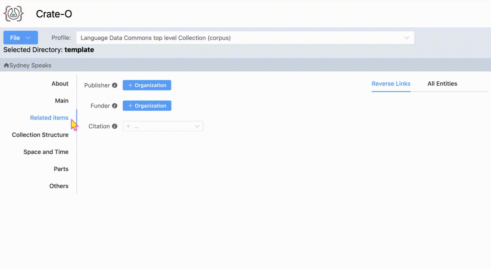
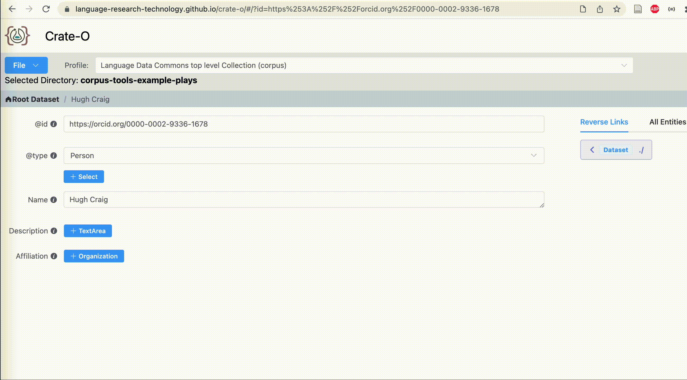
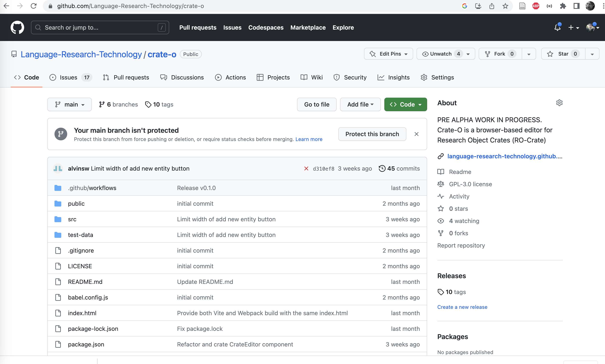
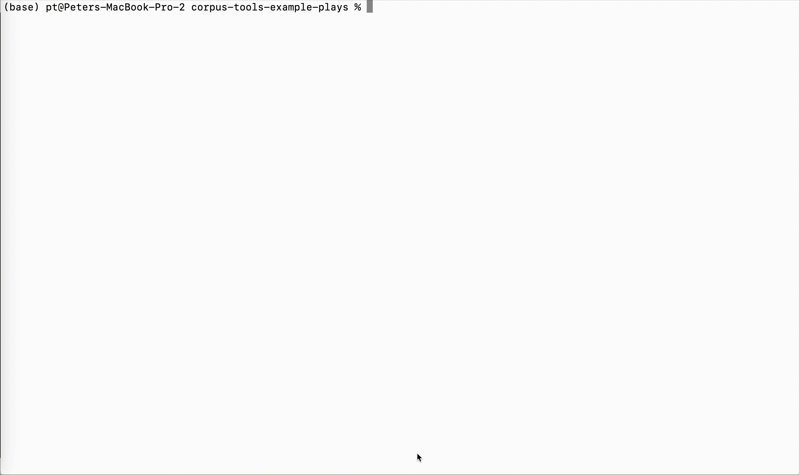

# Introducing the Oni Repository Stack
 
A Standards-based OCFL-backed repository platform build on Node.js, Postgres and ElasticSearch

Peter Sefton, Moises Sacal Bonequi, Alvin Sebastian, Mark Raadgever

::: notes

### Abstract

In this presentation we will show some of the general purpose repository tooling used to manage repository data for the Language Data Commons of Australia and the Australian Text Analytics Platform. We have a standards-based repository stack which is used to make research data available for human and machine-use. The main part of the stack is “Oni” https://github.com/Arkisto-Platform/oni which builds an access-controlled REST API from an Oxford Common File Layout (OCFL) data store (which consists of data objects which are saved as files-on-disk or in object storage), with data objects are described using the RO-Crate metadata standard. Data is indexed into a postgres-driven API for low-level access, and a full discovery index implemented in ElasticSearch, with the ability to create access portals in your web framework of choice. We will demonstrate rapid creation of large scale repositories using batch tooling, as well as using a metadata entry tool known as Describo to produce RO-Crate linked-data descriptions.

::: 

# The architecture



# Some data – ~300 plays from the 1500s



::: notes
Very often researchers will have 

:::
# Using RO-Crate-excel, execute a few maneuvers



::: notes
In this recording, we use the RO-Crate Excel tool to generate an Excel workbook listing all the files.

:::

# Paste in the researcher's data



# Fine tune using Crate-O ...



::: notes

Here we see the Crate-O metadata tool (which is a zero-install web application that runs in Chrome and other browsers that support the new FilesystemAPI) being used to add an Orgnization as the Publisher on a crate (not the plays crate).

:::

# More Crate-O



# Here's where you get Crate-O



::: notes

You can get the Crate-O source or try it out [at this github repo](https://github.com/Language-Research-Technology/crate-o).

:::

# … and you get an RO-Crate for the data



::: notes
This slide shows generating an HTML preview file that summarizes the data

:::

# Then using corpus-tools-ro-crate, make an OCFL repo


::: notes
This slide shows another script (via a make file that supplies a set of commandline paramaters) which takes the RO-Crate and "explodes" it into a set of OCFL (Oxford Common File Layout) directories in a "Storage Root" 

:::


# Start up 👹 and index stuff

Type, like:

```
> docker compose up

 ... Screenfulls of stuff

> node structural-index.js 

{ message: 'Started: database indexer' }


```


# Et Voila!


::: notes

This is a search portal for the plays with an Elastic search for full text for ~~facets~~ aggregations.

In conclusion, this repository stack is quite different from DSpace, ePrints and other repository systems where everything is built in to one application - the approach is more like the unix 

:::


